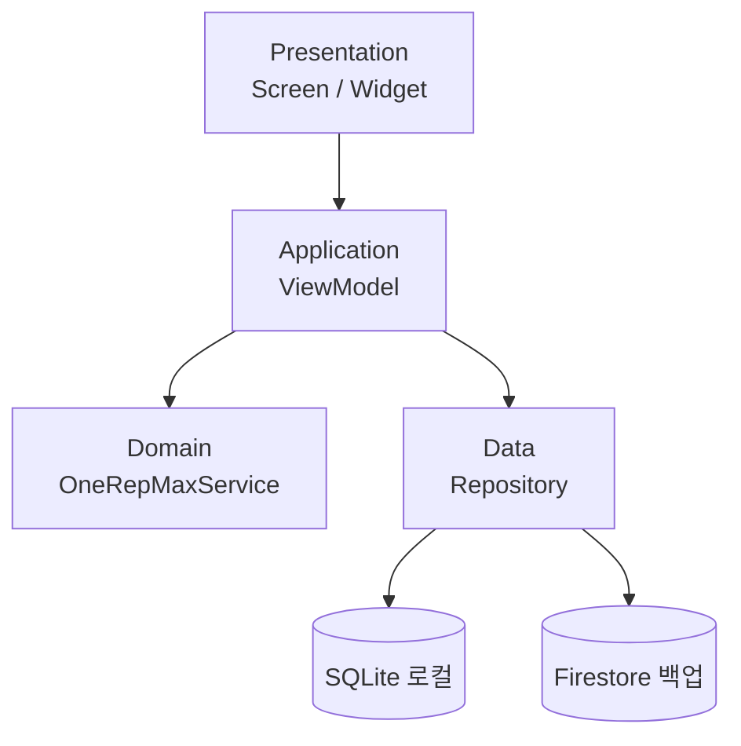

# LiftLog

> 점진적 과부하 기록과 1RM 자동 계산이 통합된 헬스 전용 모바일 앱

[]()
[]()
[]()

---

## 데모

> `docs/assets/demo.mp4` — 30초 시연 영상 (세트 기록 → 1RM 계산 → 진행 차트)

발표 슬라이드: [presentation-2min.html](./presentation-2min.html)

---

## 주요 기능

- ✨ **세트 기록** — 무게·반복·세트를 4번 터치 이내로 기록
- 🎯 **1RM 자동 계산** — 에플리(Epley) 공식 기반 추정 1RM 실시간 표시
- 📈 **진행 차트** — 운동별 1RM·볼륨 추이 그래프
- ⏱ **휴식 타이머** — 세트 완료 후 자동 시작 + 알림
- ☁️ **클라우드 백업** — Firebase 로그인 + Firestore 자동 동기화
- 📴 **오프라인 우선** — 인터넷 없이도 전 기능 동작

---

## 기술 스택

| 영역 | 사용 기술 | 결정 근거 |
|------|-----------|-----------|
| 프레임워크 | Flutter | [ADR-0001](.planning/decisions/ADR-0001-flutter-framework.md) |
| 로컬 DB | SQLite (sqflite) | [ADR-0002](.planning/decisions/ADR-0002-sqlite-local-db.md) |
| 클라우드 | Firebase (Auth + Firestore) | [ADR-0002](.planning/decisions/ADR-0002-sqlite-local-db.md) |
| 1RM 공식 | Epley | [ADR-0003](.planning/decisions/ADR-0003-epley-1rm-formula.md) |
| 상태관리 | Riverpod | — |
| 차트 | fl_chart | — |
| 테스트 | flutter_test | — |

---

## 아키텍처



자세한 내용 → [docs/architecture.md](docs/architecture.md)

---

## 빠른 시작

```bash
git clone https://github.com/whm1218-png/liftlog.git
cd liftlog
flutter pub get
flutter run
```

자세한 환경 설정 → [docs/setup.md](docs/setup.md)

---

## 빌드 / 배포

```bash
# Android 릴리스 APK
flutter build apk --release --split-per-abi
```

자세한 내용 → [docs/deploy.md](docs/deploy.md)

---

## 테스트

```bash
flutter test
```

자세한 내용 → [docs/testing.md](docs/testing.md)

---

## 프로젝트 구조

```
lib/
├── presentation/   # 화면, 위젯, 테마
├── application/    # ViewModel, UseCase
├── domain/         # 엔티티, OneRepMaxService (Epley)
└── data/           # Repository, SQLite, Firestore

test/               # 단위·통합 테스트
docs/               # setup / architecture / deploy / testing
.planning/          # 비전, 요구사항, WBS, ADR, 위험분석
.github/
├── prompts/        # /spec /plan /implement /test /review /retro
└── agents/         # code-reviewer, test-writer, bug-investigator
lessons/            # 디버깅·회고 기록
```

---

## 의사결정 로그

`.planning/decisions/` 참고 — ADR-0001(Flutter), ADR-0002(SQLite+Firebase), ADR-0003(Epley)

---

## AI Agent 활용

- **Claude** — 기획 문서, ADR, 위험분석, 발표자료
- **Cursor AI** — Flutter 코드 구현
- **워크플로우**: `/spec → /plan → /implement → /test → /review → /retro`
- 자세한 내용 → [AUTHORING.[이름].md](AUTHORING.[이름].md)

---

## 라이선스

MIT

## 만든 사람

[이름] · [GitHub: whm1218-png](https://github.com/whm1218-png)
