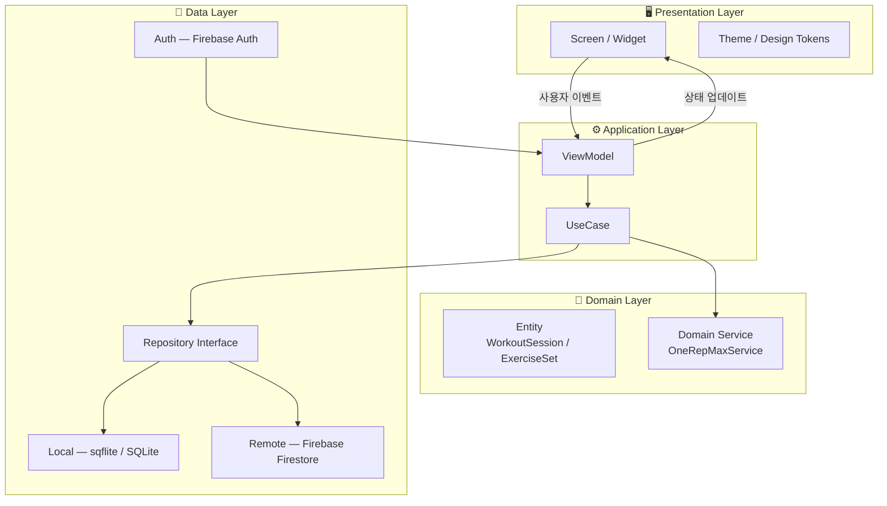

# Architecture

> 헬스 트래킹 앱 — 시스템 아키텍처 문서  
> 패턴: **Layered Architecture + MVVM**

---

## 전체 구조 다이어그램



---

## 레이어별 책임

### 1. Presentation Layer (`lib/presentation/`)

**한 줄 요약**: 사용자 눈에 보이는 것만 담당. 계산하지 않는다.

| 폴더 | 내용 |
|------|------|
| `screens/` | 전체 화면 단위 위젯 (HomeScreen, RecordScreen 등) |
| `widgets/` | 재사용 가능한 공통 위젯 (SetCard, TimerRing 등) |
| `theme/` | 색상, 폰트, 간격 등 디자인 토큰 |

**규칙**: 비즈니스 로직 금지. ViewModel에서 받은 상태를 그리기만 한다.

---

### 2. Application Layer (`lib/application/`)

**한 줄 요약**: 화면과 도메인 사이의 교통정리. 상태를 들고 있는 곳.

| 파일 | 내용 |
|------|------|
| `view_models/workout_vm.dart` | 세트 기록, 1RM 계산 트리거, 타이머 상태 |
| `view_models/progress_vm.dart` | 기간별 1RM 집계, 차트 데이터 가공 |
| `view_models/auth_vm.dart` | 로그인/로그아웃 상태 |

**규칙**: UI를 import하지 않는다. Riverpod Provider로 상태를 노출한다.

---

### 3. Domain Layer (`lib/domain/`)

**한 줄 요약**: 앱의 핵심 규칙. 프레임워크와 무관하게 순수 Dart.

| 파일 | 내용 |
|------|------|
| `entities/exercise_set.dart` | 세트 데이터 모델 (weight, reps, estimatedOneRM) |
| `entities/workout_session.dart` | 세션 모델 (date, sets) |
| `entities/exercise.dart` | 운동 마스터 (name, category) |
| `services/one_rep_max_service.dart` | Epley 공식 계산 로직 |

**핵심 규칙 — Epley 공식**:
```dart
/// reps == 1 이면 weight 그대로 반환 (실측값)
/// reps > 12 이면 오차 경고 필요
double estimate(double weight, int reps) {
  if (reps <= 0) throw ArgumentError('reps must be positive');
  if (reps == 1) return weight;
  return weight * (1 + reps / 30.0);
}
```

**규칙**: Firebase, SQLite, Flutter를 import하지 않는다. 순수 비즈니스 로직만.

---

### 4. Data Layer (`lib/data/`)

**한 줄 요약**: DB와 API를 다루는 유일한 곳.

| 파일 | 내용 |
|------|------|
| `repositories/workout_repository.dart` | 인터페이스 (추상 클래스) |
| `local/sqflite_workout_repository.dart` | SQLite 구현체 |
| `remote/firestore_sync_service.dart` | Firebase 증분 동기화 |

**규칙**: Domain Entity만 반환. Raw SQL / Firestore 문서 구조는 이 레이어 안에서만 노출.

---

## 핵심 기능 3개 — 레이어 흐름

### 기능 A: 세트 기록 → 1RM 계산 → 저장

```
RecordScreen (Presentation)
  → WorkoutViewModel.addSet(weight, reps) (Application)
    → OneRepMaxService.estimate(weight, reps) (Domain)
    → WorkoutRepository.saveSet(exerciseSet) (Data)
      → sqflite INSERT
      → synced = 0 (동기화 대기)
```

### 기능 B: 진행 그래프 조회

```
ProgressScreen (Presentation)
  → ProgressViewModel.load1RMHistory(exerciseId, period) (Application)
    → WorkoutRepository.get1RMHistory(exerciseId, from, to) (Data)
      → sqflite GROUP BY date, MAX(estimated_1rm)
  ← List<ChartDataPoint> 반환
```

### 기능 C: 클라우드 백업

```
앱 포그라운드 복귀 이벤트
  → SyncViewModel.syncPending() (Application)
    → FirestoreSyncService.uploadPending() (Data)
      → SQLite WHERE synced=0 조회
      → Firestore batch write
      → SQLite synced=1 업데이트
```

---

## SQLite 스키마 v1

```sql
CREATE TABLE exercises (
  id        TEXT PRIMARY KEY,
  name      TEXT NOT NULL,
  category  TEXT,
  is_custom INTEGER DEFAULT 0
);

CREATE TABLE routines (
  id         TEXT PRIMARY KEY,
  name       TEXT NOT NULL,
  created_at TEXT NOT NULL
);

CREATE TABLE sessions (
  id         TEXT PRIMARY KEY,
  routine_id TEXT,
  date       TEXT NOT NULL,
  FOREIGN KEY(routine_id) REFERENCES routines(id)
);

CREATE TABLE sets (
  id             TEXT PRIMARY KEY,
  session_id     TEXT NOT NULL,
  exercise_id    TEXT NOT NULL,
  weight         REAL NOT NULL,
  reps           INTEGER NOT NULL,
  estimated_1rm  REAL,
  updated_at     TEXT NOT NULL,
  synced         INTEGER DEFAULT 0,
  FOREIGN KEY(session_id)  REFERENCES sessions(id),
  FOREIGN KEY(exercise_id) REFERENCES exercises(id)
);
```

---

## 디렉토리 트리 전체

```
lib/
├── main.dart
├── app.dart
├── presentation/
│   ├── screens/
│   │   ├── home_screen.dart
│   │   ├── record_screen.dart
│   │   ├── progress_screen.dart
│   │   ├── profile_screen.dart
│   │   └── login_screen.dart
│   ├── widgets/
│   │   ├── set_card.dart
│   │   ├── timer_ring.dart
│   │   ├── one_rm_badge.dart
│   │   └── progress_chart.dart
│   └── theme/
│       ├── app_theme.dart
│       └── app_colors.dart
├── application/
│   └── view_models/
│       ├── workout_vm.dart
│       ├── progress_vm.dart
│       ├── auth_vm.dart
│       └── sync_vm.dart
├── domain/
│   ├── entities/
│   │   ├── exercise.dart
│   │   ├── exercise_set.dart
│   │   └── workout_session.dart
│   └── services/
│       └── one_rep_max_service.dart
└── data/
    ├── repositories/
    │   └── workout_repository.dart
    ├── local/
    │   ├── database_helper.dart
    │   ├── migrations/
    │   │   └── migration_v1.dart
    │   └── sqflite_workout_repository.dart
    └── remote/
        └── firestore_sync_service.dart

test/
├── domain/
│   └── one_rep_max_test.dart
├── data/
│   └── migration_test.dart
└── application/
    └── workout_vm_test.dart

docs/
├── setup.md
└── architecture.md
```

---

## 새 파일 추가 시 규칙

| 추가할 것 | 위치 |
|-----------|------|
| 새 화면 | `presentation/screens/` |
| 재사용 위젯 | `presentation/widgets/` |
| 화면 상태·로직 | `application/view_models/` |
| 비즈니스 규칙 | `domain/services/` |
| 데이터 모델 | `domain/entities/` |
| DB 쿼리 | `data/local/` |
| API 호출 | `data/remote/` |

> **판단 기준**: "이 코드가 Firebase 없이도 테스트될 수 있는가?"  
> → Yes → `domain/` 또는 `application/`  
> → No (DB/API 필요) → `data/`
