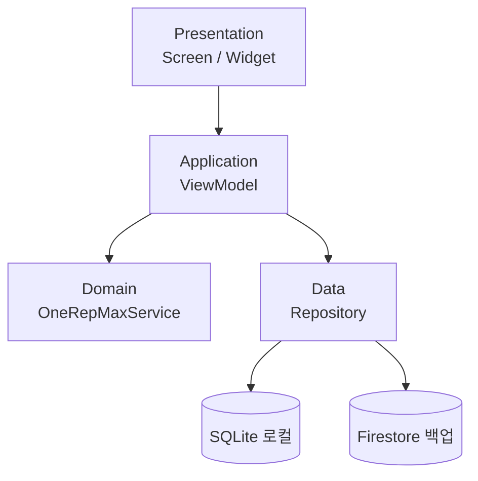

# LiftLog
## 최종 발표

점진적 과부하 기록 + 1RM 자동 계산이 통합된 헬스 전용 모바일 앱

[이름] · 2026-06-15

---

## 0. 한 줄 요약

> 헬스장에서 스마트폰 하나로 점진적 과부하를 설계하고,
> 데이터로 성장을 증명한다.

(여기에 홈 화면 스크린샷 1장)

---

## 1. 문제

- 헬스인 대부분은 운동 기록을 남기지 않는다
- "저번에 몇 kg 들었더라?" — 기억에만 의존
- 기록이 없으니 **무게를 언제 올려야 할지 모름** → 정체기 반복
- 기존 앱들은 기록 입력이 번거롭거나, 1RM을 직접 계산해주지 않음

---

## 2. 우리의 솔루션

- **핵심 아이디어**: 세트 기록을 4번 터치 이내로 끝내고, 1RM을 즉시 자동 계산
- **차별점**:
  - 에플리(Epley) 공식 기반 1RM 자동 추정 + 한계 안내
  - 오프라인 우선 (SQLite) + 클라우드 백업 (Firebase)
- **사용자 가치**: "숫자로 보는 내 성장" — 동기 부여 + 정체기 조기 발견

---

## 3. 사용자 시나리오

**김민준 · 28세 · 헬스 경력 3년 · 벤치프레스 100kg 목표**

1. 헬스장 도착 → 앱 실행 → 벤치프레스 선택
2. 80kg / 8회 입력 → 기록 (탭 4회)
3. **1RM 93.3kg 자동 표시**
4. 휴식 타이머 자동 시작 (90초)
5. 운동 종료 → 진행 차트 "이번 달 +2.5kg" 확인

---

## 4. 기술 선택

| 영역 | 선택 | 이유 |
|---|---|---|
| 프레임워크 | Flutter | 단일 코드로 iOS/Android, 자체 렌더링 (ADR-0001) |
| 로컬 DB | SQLite (sqflite) | 집계 쿼리·마이그레이션 강력 (ADR-0002) |
| 클라우드 | Firebase Auth + Firestore | 로그인 + 백업 동시 해결 (ADR-0002) |
| 1RM 공식 | Epley | 헬스 커뮤니티 표준 (ADR-0003) |
| 상태관리 | Riverpod | 레이어 분리, 테스트 용이 |

---

## 5. 아키텍처



- **Presentation**: 화면·위젯, 계산 안 함
- **Application**: ViewModel — 상태 관리, 흐름 제어
- **Domain**: 순수 Dart — Epley 공식, 엔티티
- **Data**: Repository — SQLite + Firestore 추상화

---

## 6. 데모 (3분)

**시연 시나리오**:
1. 벤치프레스 80kg × 8회 기록 → 1RM 93.3kg 자동 표시
2. 휴식 타이머 자동 시작 → 알림
3. 진행 차트 — 4주간 1RM 추이, "+2.5kg" 뱃지
4. (백업) 오프라인 모드 → 온라인 전환 시 Firestore 동기화

> 라이브 데모 불가 시 `docs/assets/demo.mp4` (30초) 재생

---

## 7. 개발 환경 / 테스트 / 배포

| 항목 | 명령 / 문서 |
|---|---|
| 환경 설정 | `docs/setup.md` |
| 테스트 | `flutter test` → `docs/testing.md` |
| 빌드 | `flutter build apk --release --split-per-abi` |
| 배포 | Firebase App Distribution → `docs/deploy.md` |
| CI/CD | `.github/workflows/build.yml` (태그 push 시 자동 빌드) |

---

## 8. AI Agent 활용

- **Claude**: 기획 문서 8개, ADR 3개, 위험분석, 발표자료, README/deploy 문서
- **Cursor AI**: Flutter 코드 구현, 폴더 구조, 컴포넌트
- **워크플로우**: `/spec → /plan → /implement → /test → /review → /retro`
- **서브에이전트**: `@code-reviewer`, `@test-writer`, `@bug-investigator`
- **본인만의 기법**: `AUTHORING.[이름].md` — 단일 파일로 워크플로우 부트스트랩

---

## 9. 회고

### 잘된 것
- ADR로 모든 기술 결정 근거를 남겨, 발표 Q&A에서 흔들리지 않음
- 오프라인 우선 설계 덕분에 동기화 버그를 일찍 발견 (lessons/ 기록)

### 어려웠던 것
- Firebase 증분 동기화 — `synced` 플래그 업데이트 순서 버그 (13주차)
- 1인 개발 일정 관리 — Should Have 일부는 v1에서 제외

### 1주일 더 있다면
- 루틴 템플릿, 볼륨 차트(Should Have) 완성
- 통합 테스트 커버리지 확대

---

## 10. 가산점 신청 요약

- [x] **A**: AI Agent 적극 활용 — 기획~배포 전 과정 문서화
- [x] **B**: 본인만의 기법 — `AUTHORING.[이름].md` 단일 부트스트랩 파일
- [ ] **C**: LLM Wiki 암묵지 운영 — `lessons/` 폴더로 일부 진행
- [ ] **D**: AI Agent 리포트 발표 — 별도 시간 신청 여부 확인 필요

증빙: `BONUS.md` 참고

---

## 11. 질문 받습니다

Q&A 준비 항목 (요약):
- 왜 Flutter / SQLite / Firebase / Epley인가 → ADR 참고
- 데이터는 어떻게 흐르나 → 4레이어 다이어그램
- 보안은 어떻게 챙겼나 → `docs/security-checklist.md`
- 마이그레이션 안전성 → `docs/testing.md` migration_test
- AI가 만든 부분 / 직접 한 부분 → 솔직히 구분해서 답변

---

# 백업 슬라이드

이하 슬라이드는 Q&A에서 호출 시 띄울 백업입니다.

---

## B1. 디렉토리 구조 상세

```
lib/
├── presentation/{screens,widgets,theme}/
├── application/view_models/
├── domain/{entities,services}/
└── data/{repositories,local,remote}/

test/{domain,data,application,widget}/
integration_test/

docs/{setup,architecture,deploy,testing,security-checklist}.md
.planning/{00-vision...06-meeting-notes, decisions/}
.github/{prompts,agents,workflows}/
lessons/
```

---

## B2. 데이터 흐름 상세

```
RecordScreen
  → WorkoutViewModel.addSet(weight, reps)
    → OneRepMaxService.estimate(weight, reps)   # Epley
    → WorkoutRepository.saveSet(exerciseSet)
      → sqflite INSERT (synced=0)
      → (백그라운드) FirestoreSyncService.uploadPending()
        → batch.commit() 성공 시 synced=1
```

---

## B3. 보안 처리

- API 키 → `.env` + `.gitignore` (코드 하드코딩 없음)
- 인증 토큰 → `flutter_secure_storage` (Keychain/Keystore)
- SQLite 쿼리 → 파라미터 바인딩(`?`)으로 SQL Injection 방지
- 통신 → Firebase SDK 기본 HTTPS

자세한 내용 → `docs/security-checklist.md`

---

## B4. 성능 / 측정 결과

| 항목 | 목표 | 측정 |
|---|---|---|
| 세트 기록 응답 | < 200ms | 로컬 SQLite 즉시 반영 |
| 탭 수 (기록 1회) | ≤ 4 | 4 |
| 앱 시작 → 첫 기록 | ≤ 10s | 측정 진행 중 |
| 오프라인 동작 | 100% | 기록·조회 전체 가능 |

---

## B5. 외부 API / 라이브러리 목록

| 패키지 | 버전 | 용도 |
|---|---|---|
| sqflite | ^2.3.3 | 로컬 SQLite |
| firebase_core / auth / firestore | ^3.x / ^5.x | 인증·백업 |
| flutter_riverpod | ^2.5.1 | 상태관리 |
| go_router | ^14.2.0 | 라우팅 |
| fl_chart | ^0.69.0 | 진행 차트 |
| flutter_secure_storage | ^9.2.2 | 토큰 보관 |
